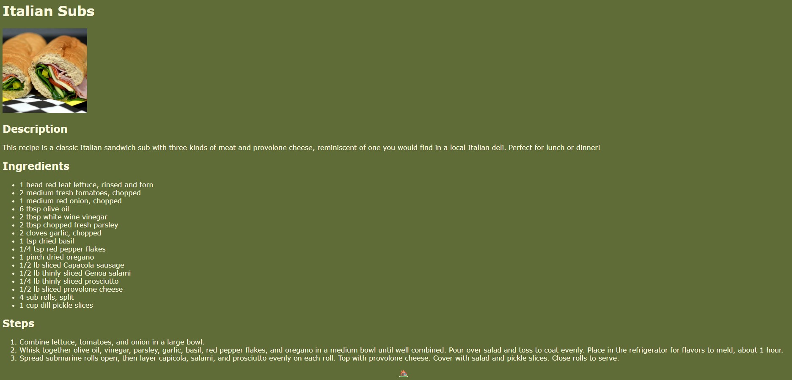

# The Odin Project HTML Recipes

## 📜 Description
This repo contains a basic static website with three recipes, completed as part of The Odin Project Foundations Recipes project: [Recipes Project](https://www.theodinproject.com/lessons/foundations-recipes)

## 🛠️ Technologies
* HTML
* CSS

## ⚡ Install
To install the project, utilize the following command in the command line:

```
git clone https://github.com/jbudcardi/html-recipes.git
```

Alternatively, the project can be downloaded in .ZIP format from the repo web page.

## 📷 Demo Images


